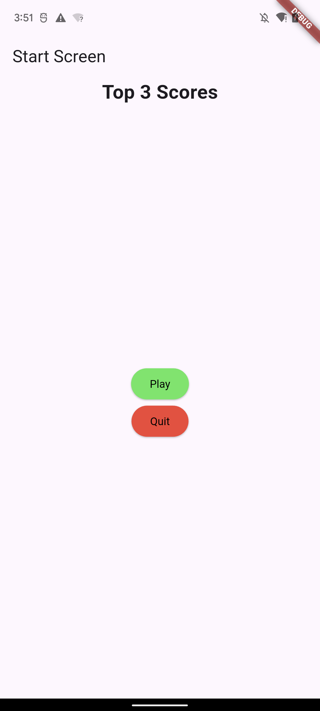
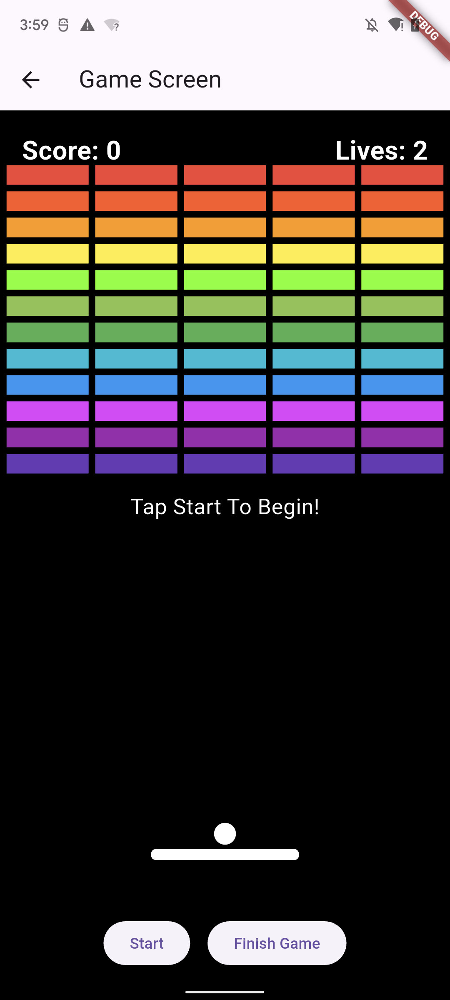
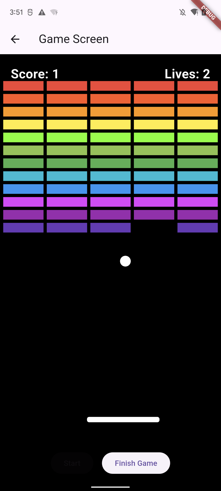
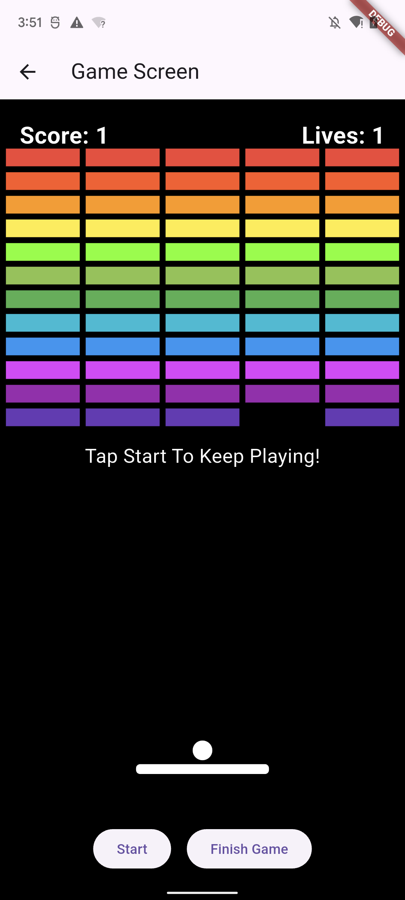
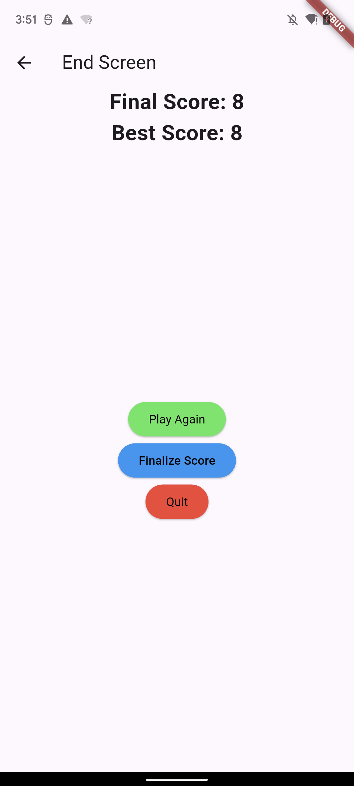
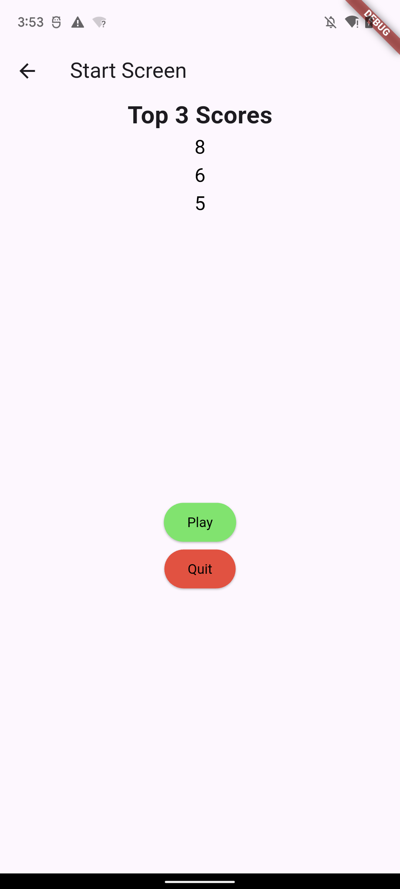

- Initial Commit: Mark Belmonte
- Making sure push and pulls work: Mark Belmonte

- Second Commit: David Krause

- Thrird Test comit: Jaxon Treadwell

- Second 2nd Commit: David Krause

# Ball Bounce Breaker
 
A game where the player bounces a ball upwards to break blocks using the accelerometer sensor on the phone to control the paddle.

## Who the app is for

## What it does

## Why it's useful
 

## Features
 

## Screenshots

## Built with / Resources
 
[Flutter](https://flutter.dev/)

[Dart](https://dart.dev/)

- [Accelerometer/sensors]

sensors_plus package: https://pub.dev/packages/sensors_plus

AccelerometerEvent class reference: https://pub.dev/documentation/sensors_plus_platform_interface/latest/sensors_plus_platform_interface/AccelerometerEvent-class.html

- [Timers/game_loop]

Timer.periodic: https://api.flutter.dev/flutter/dart-async/Timer/Timer.periodic.html

StreamSubscription: https://api.flutter.dev/flutter/dart-async/StreamSubscription-class.html

- [Layout(paddle/ball_positioning)]

LayoutBuilder: https://api.flutter.dev/flutter/widgets/LayoutBuilder-class.html

Stack and Positioned: https://api.flutter.dev/flutter/widgets/Stack-class.html / https://api.flutter.dev/flutter/widgets/Positioned-class.html

Align and Alignment: https://api.flutter.dev/flutter/widgets/Align-class.html

WidgetsBinding.addPostFrameCallback: https://api.flutter.dev/flutter/scheduler/SchedulerBinding/addPostFrameCallback.html

- [Custom_drawing(blocks)]

CustomPainter: https://api.flutter.dev/flutter/rendering/CustomPainter-class.html

Canvas: https://api.flutter.dev/flutter/dart-ui/Canvas-class.html

Canvas.drawRect: https://api.flutter.dev/flutter/dart-ui/Canvas/drawRect.html

- [Navigation_between_screens]

Navigator: https://api.flutter.dev/flutter/widgets/Navigator-class.html

Named routes guide: https://docs.flutter.dev/cookbook/navigation/named-routes

- [State_management_basics]

StatefulWidget/State: https://api.flutter.dev/flutter/widgets/StatefulWidget-class.html

setState: https://api.flutter.dev/flutter/widgets/State/setState.html

## Work Docs

[Requirement_Doc] https://hendrix-my.sharepoint.com/:w:/r/personal/krausedl_hendrix_edu/Documents/Sensory%20Overload%20Requirments%20Doc.docx?d=w1064e67e6f5046c69e2fc26ecaa115d9&csf=1&web=1&e=nxgRBY

[First_Presentation] https://docs.google.com/presentation/d/1s8XP4nJrc6w363PF6fW3EMkMZ1vDpfIJx-UiN6sDC-A/edit?usp=sharing

[Demo_Presentation] https://docs.google.com/presentation/d/1zZSQLowAW2DXmaE0QDZCExtSnGM8DQAyFESD9EovJeA/edit?usp=sharing 